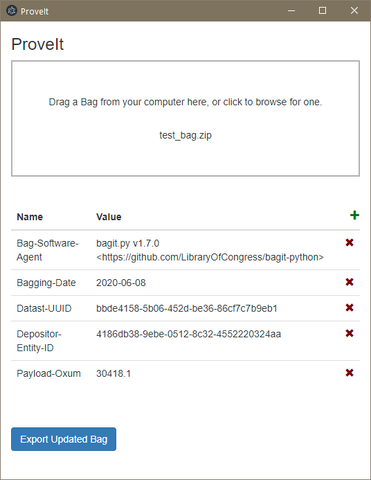

# ProveIt



This is intended to eventually replace https://github.com/LibraryOfCongress/bagger, which has been called "effectively deprecated" (and who wants to use desktop Java at this point anyway). The main purpose is to be able to load and validate a bag, and edit some properties in a nice GUI, possibly according to a template. Screenshots forthcoming when it's closer to feature-complete.

## Development
```
$ pip install -r requirements.txt --user
$ cd gui
$ npm install
$ npm start
```

## Building
The Python code needs to be built on its target platform using `pyinstaller`:

`pyinstaller -w proveit.py --distpath gui`

(On Mac, this also builds a .app version of the Python code, which you'll actually want to delete -- just keep the folder of CLI tools.)

After building the crawler, the GUI can be built from the `gui` subdirectory with:

`electron-packager . --icon=resources/icon.ico` (Windows)

`electron-packager . --icon=resources/icon.icns` (Mac)

On Mac, you can sign for distribution with `electron-osx-sign` and `electron-notarize-cli`, and you need to include the embedded Python binaries:

`IFS=$'\n' && electron-osx-sign proveit-darwin-x64/sfu-moveit.app/ $(find proveit-darwin-x64/sfu-moveit.app/Contents/Resources/app/ -type f -perm -u+x) --identity [hash] --entitlements=entitlements.plist --entitlements-inherit=entitlements.plist --hardenedRuntime`

`electron-notarize --bundle-id ca.sfu.proveit --username my.apple.id@example.com --password @keystore:AC_PASSWORD proveit-darwin-x64/proveit.app/`

Finally, to package for install:

`electron-installer-windows --src proveit-win32-x64/ --dest install/ --config config.json` (Windows)

`hdiutil create tmp.dmg -ov -volname "proveit" -fs HFS+ -srcfolder proveit-darwin-x64/ && hdiutil convert tmp.dmg -format UDZO -o ProveIt.dmg && rm tmp.dmg` (Mac)
